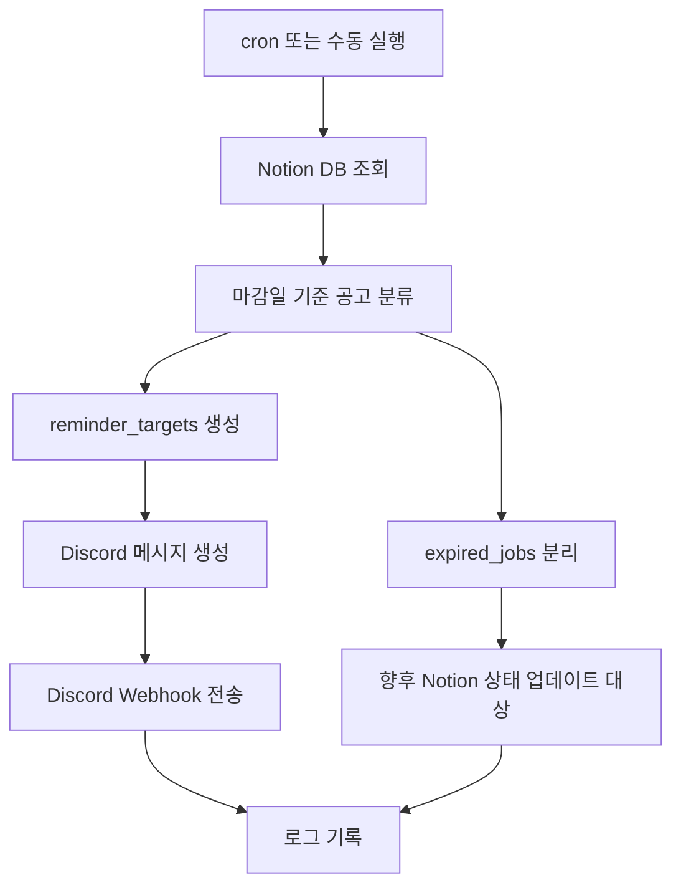

# job-automation-system

Notion에 정리한 채용 공고를 자동으로 조회하고, 조건에 맞는 공고를 Discord로 알려주는 개인 취업 관리 자동화 프로젝트입니다.  
`Python` `Notion API` `Discord Webhook` `cron` `개인 생산성 자동화`

## 📌 프로젝트 개요

취업 준비를 하다 보면 공고를 저장하는 것보다, **언제 다시 확인해야 하는지**와 **마감이 임박한 공고를 놓치지 않는 것**이 더 어렵습니다.  
이 프로젝트는 그 문제를 해결하기 위해 만든 **1인 사용자용 채용 공고 자동화 시스템**입니다.

저는 채용 공고를 Notion 데이터베이스에 직접 정리하고 있었는데, 시간이 지나면서 아래 문제가 반복됐습니다.

- 관심 공고가 많아질수록 다시 확인해야 할 공고를 놓치기 쉬움
- 마감일이 가까운 공고만 따로 추려보는 과정이 번거로움
- 수동 확인을 하지 않으면 중요한 공고를 늦게 보게 됨
- 메일보다 모바일에서 즉시 확인하기 쉬운 알림 채널이 필요함

이 프로젝트는 위 문제를 해결하기 위해 다음 흐름으로 동작합니다.

1. Notion DB에서 채용 공고를 조회합니다.
2. 마감일 기준으로 오늘 확인해야 할 공고만 선별합니다.
3. 선별된 공고를 Discord Webhook으로 전송합니다.
4. cron으로 정해진 시간에 자동 실행합니다.
5. 실행 결과를 로그 파일로 남겨 운영 상태를 확인할 수 있게 합니다.

즉, 단순한 CRUD 예제가 아니라 **실제 개인 워크플로우를 줄이기 위한 자동화 프로젝트**라는 점이 핵심입니다.

## ✅ 주요 기능

### 1. Notion 채용 공고 조회

- Notion API를 통해 특정 데이터베이스의 공고 목록 조회
- 공고명, 회사명, 진행상황, 우선순위, 마감일 등 운영 필드 파싱
- Notion `page_id`를 함께 유지해 향후 상태 업데이트 확장 가능하게 설계

### 2. 마감일 기반 알림 대상 선별

- `지원완료` 상태 공고는 제외
- 마감일이 없는 공고는 제외
- 마감일이 지난 공고는 `expired_jobs`로 분리
- `D-7`, `D-3`, `D-1`, `D-day`만 `reminder_targets`로 포함
- 우선순위 `상 / 중 / 하`는 모두 허용

### 3. Discord Webhook 알림 전송

- Discord를 기본 알림 채널로 사용
- D-day에 따라 이모지 강조
  - `D-day`: 🔥
  - `D-1 ~ D-3`: ⚠️
  - `D-7`: 📌
- 여러 공고를 읽기 쉬운 다중 줄 메시지로 구성
- Discord 전송 실패 시 프로그램은 종료하지 않고 로그만 남김

### 4. cron 자동 실행

- 수동 실행 없이 정해진 시간에 자동으로 공고 확인 가능
- 프로젝트 루트 기준 cron 등록 예시 제공
- 가상환경 Python 경로를 직접 지정하는 방식으로 운영 안정성 확보

### 5. 로그 기록

- 실행 시각 기록
- 알림 대상 개수 기록
- Discord payload 길이 및 preview 기록
- cron 환경에서도 `logs/cron.log`에 누적 저장 가능

### 현재 구현 상태

- [x] Notion DB 조회
- [x] 마감일 기반 reminder target 선별
- [x] Discord Webhook 알림 전송
- [x] cron 기반 자동 실행 준비
- [x] 로그 파일 기록 구조
- [x] 리마인더 정책 테스트 코드 작성
- [ ] 중복 알림 방지
- [ ] Notion 상태 자동 업데이트

## 🛠 기술 스택

- Language
  - Python 3
- External Integration
  - Notion API
  - Discord Webhook
- Runtime / Automation
  - cron
- Configuration
  - `.env`
- 주요 라이브러리
  - `notion-client`
  - `python-dotenv`
  - `requests`
  - `pytest`

표준 라이브러리도 적극 활용했습니다.

- `datetime`
- `logging`
- `os`
- `sqlite3`
- `smtplib`

## 🔄 시스템 동작 흐름



텍스트로 보면 다음과 같습니다.

`Notion DB 조회 → 알림 대상 필터링 → Discord 전송 → 로그 저장`

## 📂 프로젝트 구조

```text
job-automation-system/
├─ app/
│  ├─ main.py
│  ├─ config.py
│  ├─ scheduler.py
│  ├─ services/
│  │  ├─ notion_service.py
│  │  ├─ reminder_service.py
│  │  ├─ discord_service.py
│  │  └─ email_service.py
│  ├─ utils/
│  │  ├─ date_utils.py
│  │  └─ logger.py
│  └─ db/
│     └─ sqlite.py
├─ tests/
│  ├─ test_scheduler.py
│  └─ test_reminder_service.py
├─ logs/
├─ requirements.txt
├─ .env.example
└─ README.md
```

핵심 파일:

- `app/main.py`
  - 전체 실행 흐름 오케스트레이션
- `app/services/notion_service.py`
  - Notion 조회 및 향후 상태 업데이트 골격
- `app/services/reminder_service.py`
  - reminder target / expired jobs 분류 정책
- `app/services/discord_service.py`
  - Discord 메시지 포맷팅 및 Webhook 전송
- `tests/test_reminder_service.py`
  - 알림 정책 테스트

## 🚀 실행 방법

### 1. 가상환경 생성 및 활성화

```bash
python3 -m venv .venv
source .venv/bin/activate
```

### 2. 패키지 설치

```bash
pip install -r requirements.txt
```

### 3. 환경변수 설정

```bash
cp .env.example .env
```

### 4. 수동 실행

```bash
python3 -m app.main
```

### 5. cron 등록 예시

```cron
0 9 * * * cd /home/kimdaeho1998/job-automation-system && /home/kimdaeho1998/job-automation-system/.venv/bin/python -m app.main >> /home/kimdaeho1998/job-automation-system/logs/cron.log 2>&1
0 18 * * * cd /home/kimdaeho1998/job-automation-system && /home/kimdaeho1998/job-automation-system/.venv/bin/python -m app.main >> /home/kimdaeho1998/job-automation-system/logs/cron.log 2>&1
```

등록 명령:

```bash
crontab -e
```

## 🔐 환경변수 설명

예시:

```env
NOTION_API_KEY=your_notion_api_key
NOTION_DB_ID=your_notion_database_id
DISCORD_ENABLED=true
DISCORD_WEBHOOK_URL=https://discord.com/api/webhooks/your_webhook_url
```

설명:

- `NOTION_API_KEY`
  - Notion API 인증 키
- `NOTION_DB_ID`
  - 조회할 Notion 데이터베이스 ID
- `DISCORD_ENABLED`
  - Discord 알림 사용 여부
- `DISCORD_WEBHOOK_URL`
  - Discord Webhook URL

추가로 이메일 관련 환경변수도 코드상 유지하고 있지만, 현재 기본 알림 채널은 Discord입니다.

## 💡 구현 포인트 / 문제 해결

### 1. 개인 워크플로우 자동화에 집중

이 프로젝트는 다중 사용자 SaaS가 아니라, **실제로 제가 취업 공고를 관리하는 방식 자체를 자동화**하는 데 초점을 맞췄습니다.  
즉 “기능을 많이 넣는 것”보다 **반복 업무를 줄이는 것**이 핵심 목표였습니다.

### 2. Gmail보다 Discord를 우선 적용한 이유

초기에는 이메일도 고려했지만, 실제 사용성을 기준으로 보면 Discord가 더 적합했습니다.

- 모바일 푸시 확인이 빠름
- 개인 서버 없이 Webhook만으로 연결 가능
- 포맷을 읽기 쉽게 구성하기 좋음
- 테스트와 운영이 단순함

그래서 이메일 구조는 유지하되, 현재 기본 동작은 Discord 알림 중심으로 설계했습니다.

### 3. 단순 조회가 아니라 “조건 기반 선별”에 집중

단순히 공고 목록을 읽는 것만으로는 자동화 가치가 낮습니다.  
이 프로젝트는 실제로 필요한 액션을 만들기 위해 다음 조건을 코드로 분리했습니다.

- `지원완료` 제외
- 마감일 없음 제외
- 지난 공고 분리
- `D-7`, `D-3`, `D-1`, `D-day`만 알림

이렇게 해서 **실제 확인이 필요한 공고만 전달하는 구조**를 만들었습니다.

### 4. 운영 환경을 고려한 cron + 로그 구조

수동 실행만 가능한 스크립트로 끝내지 않고, cron 등록과 로그 파일 기록까지 포함해 **실제 반복 실행 가능한 형태**로 맞췄습니다.

- `logs/` 디렉토리 자동 생성
- `cron.log` 누적 기록
- 실행 시각 / payload preview / 전송 결과 로그 기록

즉, “코드가 돌아간다” 수준이 아니라 **반복 운영 가능한 자동화 스크립트**에 가깝게 정리했습니다.

## 🔧 개선 예정 사항

- 중복 알림 방지
- Notion 알림 이력 업데이트
- 만료 공고 자동 `마감` 처리
- 운영 로그 대시보드화
- Discord 메시지 길이 초과 시 자동 분할 전송
- 우선순위/상태 기반 세부 알림 정책 고도화

## 🧪 테스트 정책

현재 `pytest` 기반으로 리마인더 정책 테스트를 작성했습니다.

검증 항목:

- `지원완료` 제외 여부
- 마감일 없는 공고 제외 여부
- 지난 공고 `expired_jobs` 분리 여부
- `D-7`, `D-3`, `D-1`, `D-day`만 포함되는지
- `D-2`, `D-5`가 제외되는지
- 우선순위 `상 / 중 / 하` 허용 여부
- 날짜 파싱 실패 시 제외되는지

실행:

```bash
python3 -m pytest tests/test_reminder_service.py
```

## 📄 Discord 알림 예시

```text
📢 채용 공고 알림

🔥 [D-day] 풀무원 - [인턴]AX /DX
   상태: 관심 | 우선순위: 없음
   마감일: 2026-03-25

⚠️ [D-3] 케이엔에스에듀 - 데이터 전문관리자
   상태: 관심 | 우선순위: 하 (Low)
   마감일: 2026-03-28

📌 [D-7] Toss Career - Data Analyst
   상태: 지원 준비중 | 우선순위: 상 (High)
   마감일: 2026-04-01
```

## 📝 실행 로그 예시

```text
2026-03-25 01:19:02,095 | INFO | job_automation | Starting job automation system
2026-03-25 01:19:02,095 | INFO | job_automation | Scheduler execution timestamp: 2026-03-25T01:19:02
2026-03-25 01:19:02,634 | INFO | job_automation | Expired jobs queued for cleanup: 0
2026-03-25 01:19:02,634 | INFO | job_automation | Discord notification enabled
2026-03-25 01:19:02,634 | INFO | job_automation | Sending Discord notification for 4 reminder target(s)
2026-03-25 01:19:02,634 | INFO | job_automation | Formatted Discord message length: 315
2026-03-25 01:19:02,957 | INFO | job_automation | Discord notification sent successfully
```

## 회고 / 기대 효과

이 프로젝트를 통해 단순히 API를 연결하는 수준이 아니라, **실제 개인 업무 흐름을 코드로 재설계하는 방식**을 보여주고자 했습니다.

이 프로젝트가 보여주는 역량은 다음과 같습니다.

- 개인 워크플로우를 자동화 대상으로 정의하는 능력
- 외부 서비스(Notion, Discord)를 연결해 실사용 가능한 흐름을 만드는 능력
- 조건 기반 알림 정책을 코드로 설계하는 능력
- cron과 로그를 고려해 반복 운영 가능한 구조로 만드는 능력

거창한 서비스보다는, **작지만 실제로 쓰는 자동화 도구를 끝까지 구현하고 개선한 프로젝트**로 봐주시면 좋겠습니다.
